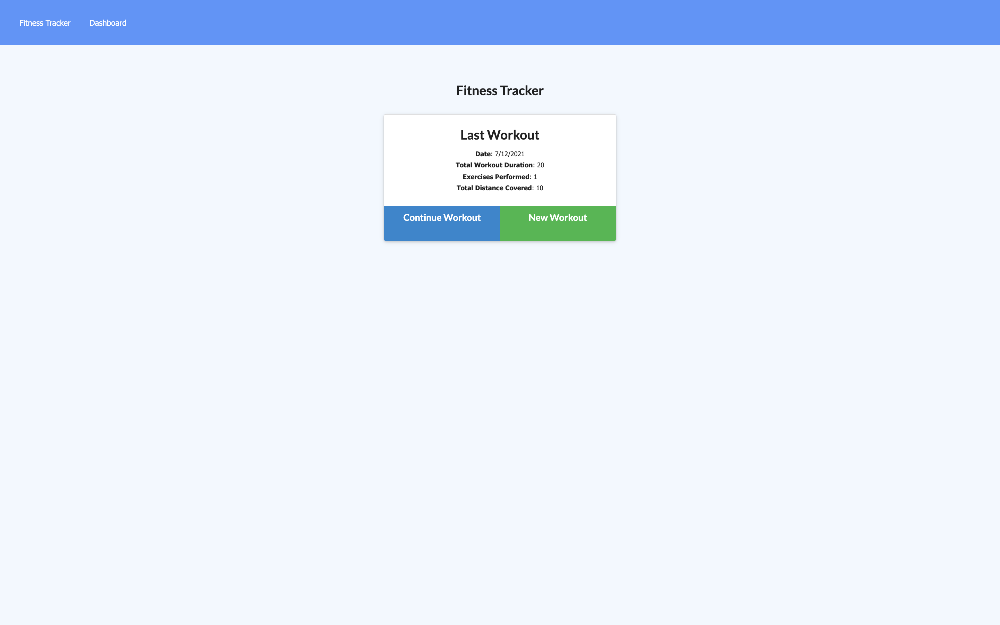
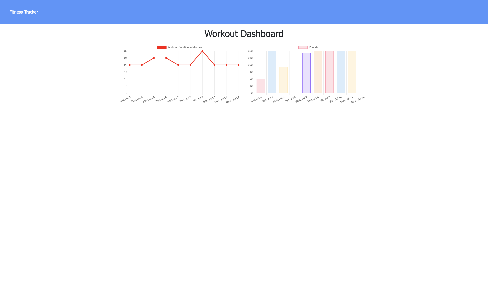

# workout-tracker

## Description
this application is a fitness tracker which uses mongoDB database and mongoose, there are two different types of work out resistance and cardio you pick which workout you want to use and it saves your last specific work . it also has charts to specify workout duration and pounds for the week.

## Installation
To install the app you can clone it from this repo https://github.com/johnbatista1223/workout-tracker to local machine, also install node.js. once node is installed you can seed your mongo database using the npm run seed in your terminal.
## Usage
 once everything is up and loaded you can load up page in browser using local host 3001 then you can start the app normally and pick each work out to log !
 
 

## License
MIT License

Copyright (c) [2021] [john batista]

Permission is hereby granted, free of charge, to any person obtaining a copy
of this software and associated documentation files (the "Software"), to deal
in the Software without restriction, including without limitation the rights
to use, copy, modify, merge, publish, distribute, sublicense, and/or sell
copies of the Software, and to permit persons to whom the Software is
furnished to do so, subject to the following conditions:

The above copyright notice and this permission notice shall be included in all
copies or substantial portions of the Software.

THE SOFTWARE IS PROVIDED "AS IS", WITHOUT WARRANTY OF ANY KIND, EXPRESS OR
IMPLIED, INCLUDING BUT NOT LIMITED TO THE WARRANTIES OF MERCHANTABILITY,
FITNESS FOR A PARTICULAR PURPOSE AND NONINFRINGEMENT. IN NO EVENT SHALL THE
AUTHORS OR COPYRIGHT HOLDERS BE LIABLE FOR ANY CLAIM, DAMAGES OR OTHER
LIABILITY, WHETHER IN AN ACTION OF CONTRACT, TORT OR OTHERWISE, ARISING FROM,
OUT OF OR IN CONNECTION WITH THE SOFTWARE OR THE USE OR OTHER DEALINGS IN THE
SOFTWARE.